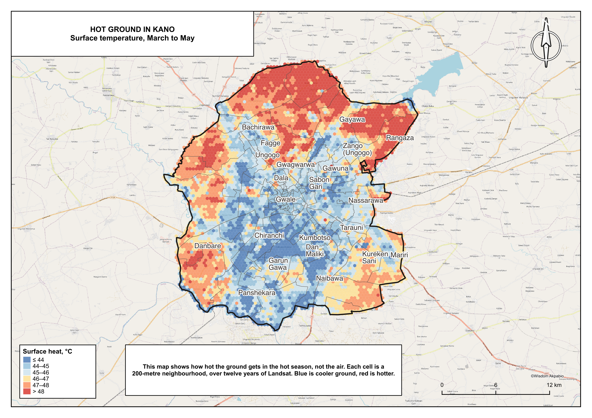
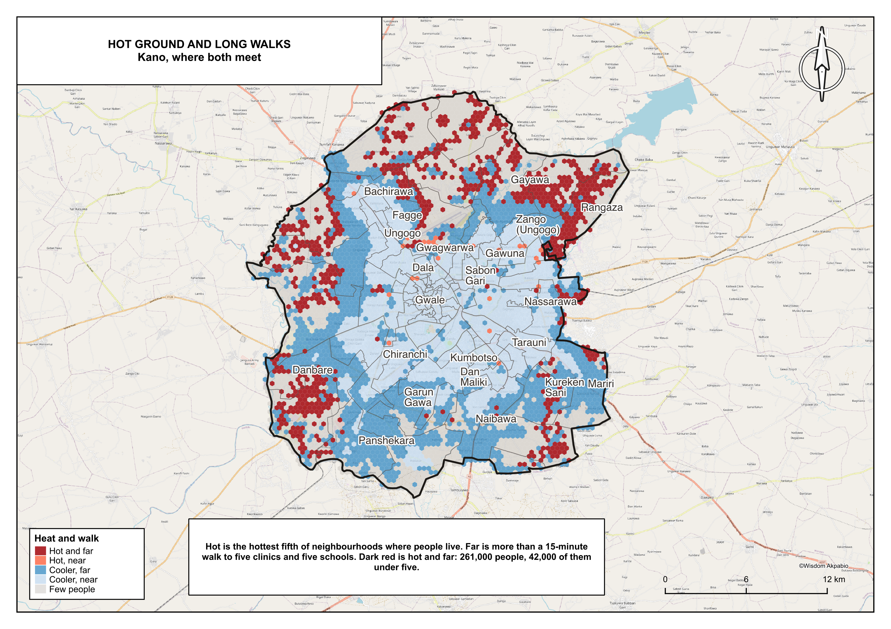
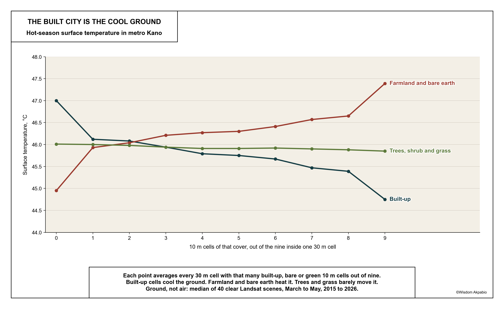
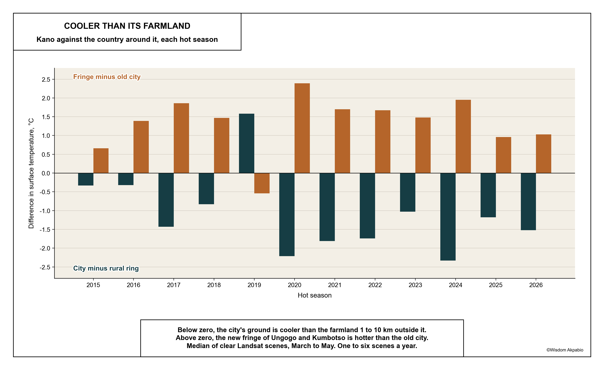

# Hot ground

**Surface heat, land cover and people in metropolitan Kano**

Adaptation of Ramachandra, Rana, Vinay & Aithal (2025), [Urban heat island linkages with the landscape morphology](https://doi.org/10.1038/s41598-025-09141-5), *Scientific Reports* 15, 24485. **This is not a replication.** The anchor uses one April 2022 scene over humid Bangalore, uncorrected Landsat thermal, a field-trained land-use map and no population. Here: every clear Landsat 8/9 hot-season scene over semi-arid Kano from 2015 to 2026, USGS Level-2 surface temperature, ESA WorldCover, and GRID3 population on the same hexes as [*Fifteen minutes on foot*](https://github.com/whizialfa/15-min-cities-nigeria).

Write-up: [`notes/results.md`](notes/results.md). Trace from raw input to every quoted number, and every departure from the anchor: [`notes/metric_trace.md`](notes/metric_trace.md).

## Findings

**Kano is cooler than the farmland around it in the hot dry season.** In all 28 clear scenes from March and April, 2015 to 2026, the city's median surface was cooler than a ring 1 to 10 km outside it (median −1.6 °C) and the fringe of Ungogo and Kumbotso was hotter than the old city (median +1.75 °C). The three exceptions are all May scenes, after early rain.

**Built-up ground is the cool ground.** Each extra built-up 10 m cell in a 30 m pixel lowers hot-season surface temperature, from 47.0 °C with none to 44.8 °C with nine of nine. Farmland and bare earth raise it (45.0 to 47.4 °C). Trees, shrub and grass barely move it. Greenness (NDVI) has no relationship with surface heat in any year (r −0.04 to +0.20; Bangalore −0.46).

**People mostly live on cooler ground, except on the farmland edge.** Population-weighted surface temperature is 45.0 °C against 46.0 °C for the average hexagon. 95% of the people on the hottest fifth of populated ground are also more than 15 minutes' walk from clinics and schools: 261,000 people, 42,000 of them under five. The hottest populated wards are Karo, Yada Kunya, Rangaza and Fanisau in Ungogo, and Chalawa in Kumbotso.

| | |
|---|---|
|  |  |
|  |  |

Plates are A3 PNG and PDF in `maps/`, built by `qgis/build_heat_plates.py` with QGIS's Python (`env -u PYTHONPATH /Applications/QGIS.app/Contents/MacOS/bin/python3.9 qgis/build_heat_plates.py`). The furniture is imported from the walking paper's builder, so both papers print as one family.

This is surface temperature, not air temperature: how hot the ground is at about 10:30, not heat stress.

## Frame

- **Study area:** Kano metropolitan area, eight LGAs, 573 km², 5.78 million people; the walking paper's outline. Rural reference: 1 to 10 km outside it.
- **Hot season:** March to May. 40 scenes, one to six a year, all from WRS-2 path 188, row 52, each ≥ 98% clear over the city.
- **Land use:** ESA WorldCover 2021, nine 10 m cells per 30 m pixel. Dry-season cropland run both as vegetation (anchor) and as bare.

## Run

```bash
export PYTHONPATH="$PWD/src"
python -m kanoheat.inputs                          # copy the Kano frame from 15-min-cities-nigeria
python -m kanoheat.scenes                          # score every scene on the city (≈3 min)
python -m kanoheat.lst --season hot --years 2015-2026
python -m kanoheat.series                          # yearly contrasts, pooled surface, hot spots, UTFVI
python -m kanoheat.series --scenes                 # per-scene contrasts (≈2 min)
python -m kanoheat.composition                     # WorldCover mix per 30 m pixel
python -m kanoheat.indices --years 2015-2026       # spectral indices (≈15 min)
python -m kanoheat.regression
python -m kanoheat.exposure                        # hexes, people, wards, walking time
python -m kanoheat.charts
```

Analysis Python is `/opt/anaconda3/bin/python3.12`. Rasters land in `data/raw/` and are not committed; quoted tables are in `data/processed/*.csv`. Times: [`notes/task_times.md`](notes/task_times.md).

## Next

Print plates (hot-season surface, and heat against walking time) in the walking paper's style, a short brief, and the colour PDF.
