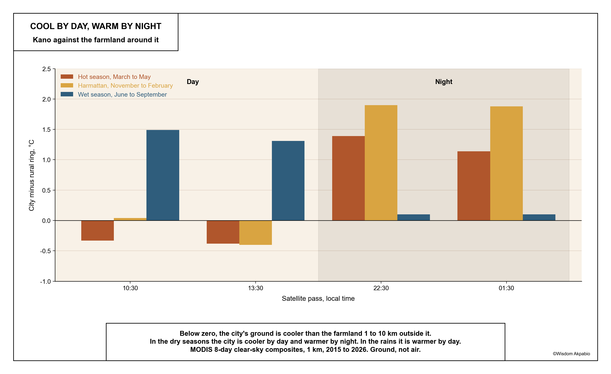

Most people picture a city as a heat island: hotter than the country around it, day and night. Kano is not quite that. On a hot March morning, the ground in the city is cooler than the farmland around it. After dark it is the other way round.

These numbers come from satellites that measure how hot the ground, roofs and trees are, not how hot the air feels. Landsat photographs Kano at about 10:30 in the morning. Two MODIS satellites add passes at 13:30, 22:30 and 01:30. The study area is metropolitan Kano, eight local government areas and 5.8 million people, the same outline used in *Fifteen minutes on foot*.

# Cooler than its fields by day

In every clear Landsat picture from March and April since 2015, 28 of them, the city's ground was cooler than the farmland 1 to 10 km outside it, typically by about 1.6 °C. In the same pictures, the new edge of the city in Ungogo and Kumbotso was hotter than the old city, by about 1.75 °C. The only exceptions come in May, after the first storms wet the fields.

The reason is what covers the ground. In the hot season, farmland is bare, dry earth with nothing to cool it, and it bakes. The old city is thick walls, courtyards, narrow shaded lanes and yard trees, and much of what the satellite sees there is shade. Built-up ground covers 45% of the metropolitan area and cropland 40%. The more of a small patch is built up, the cooler its ground: fully built patches average 44.8 °C, patches with no buildings 47.0 °C. Greenness, as a satellite measures it, makes almost no difference in March.

<figure class="brief-plate">

<figcaption>Hot ground in Kano. Hot-season surface temperature, March to May, averaged over twelve years. Blue is cooler ground, red is hotter. The cool blue runs through the old city and the dense south; the red sits on the northern and western farmland.</figcaption>
</figure>

# Warmer by night

After dark the pattern turns over. Bare fields lose their heat quickly; walls and roofs give theirs back slowly. At 22:30 and 01:30 in the hot season, the city's ground is about 1.1 to 1.4 °C warmer than the farmland, and the old city, the coolest ground at mid-morning, becomes the warmest place in Kano. In the harmattan the night-time gap is nearly 2 °C. In the rains the story changes again: the fields are green and wet, and the city is the warmer ground by day.

<figure class="brief-chart">

<figcaption>Below zero, the city's ground is cooler than the farmland around it. In the dry seasons that is true by day and false by night.</figcaption>
</figure>

# Who lives on the hottest ground

Most people in Kano live on the cooler ground. The hottest tenth of lived-in neighbourhoods holds about 122,000 people, 2% of the city. But those who do live on hot ground are almost all far from services. Of the 276,000 people on the hottest fifth of lived-in ground, 95% are more than a 15-minute walk from five clinics and five schools. That is 261,000 people, 42,000 of them under five. The hottest wards are Karo, Yada Kunya, Rangaza and Fanisau in Ungogo, and Chalawa in Kumbotso.

<figure class="brief-plate">

<figcaption>Hot ground and long walks. Dark red is the hottest fifth of lived-in neighbourhoods that are also more than a 15-minute walk from clinics and schools. Almost none of the hottest ground is close to services.</figcaption>
</figure>

# Where the city is growing

Kano is building onto that hot edge. Built-up land grew from about 38% of the metropolitan area in 2015 to 52% in 2026, and an independent satellite map shows the same rise. Where farmland was built over, the ground cooled by day compared with farmland that stayed open, by about 0.3 to 0.6 °C. The new neighbourhoods are in Gayawa, Rangaza, Kadawa and Tudun Fulani in Ungogo, and in Garun Gawa, Kureken Sani, Danbare and Mariri in Kumbotso.

That cooling is a daytime result. The same walls that cool the new edge at mid-morning are the ones that keep the old city warm at night.

# What this means

Two places matter, at two times of day. By day it is the farmland edge, where the city is growing and where people are both on the hottest ground and farthest from clinics and schools. By night it is the dense old city, which shelters people from the midday sun and holds the most heat while they sleep. Advice written for other cities, such as more green cover per plot, fits Kano poorly in March: what cools the ground here by day is shade and moisture.

# What this does not show

This is the temperature of surfaces, not of the air, and not heat stress: there is no humidity or wind here. The night-time figures are at 1 km, coarser than the 30 m daytime maps. Population figures are modelled, and they apply the same age structure everywhere in the city, so they give counts of children and elders but cannot show whether children live on hotter ground than adults.

This study adapts the method of Ramachandra, Rana, Vinay and Aithal (2025), who studied Bangalore from a single morning picture. Kano adds twelve years of pictures, night-time passes, land cover for every year, and the people who live on the ground.
